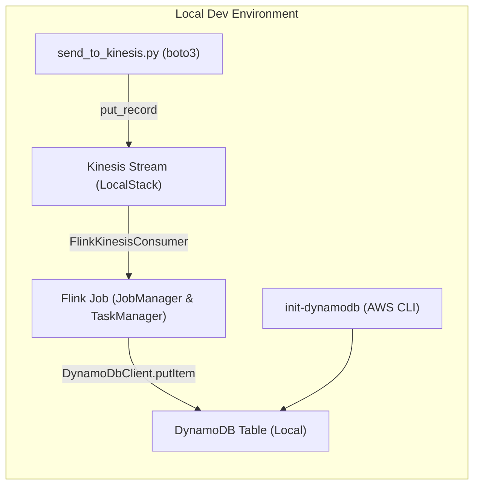
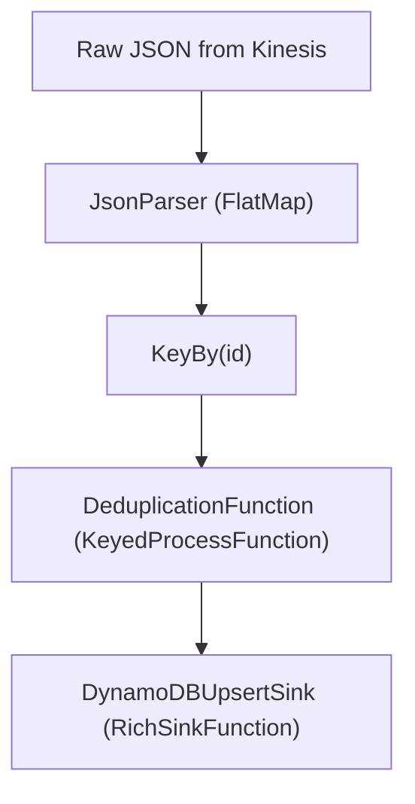

# Flink → Kinesis (LocalStack) → DynamoDB (Local)

A complete sample project demonstrating how to run an Apache Flink job that:

1. **Consumes** JSON events from a Kinesis stream emulated by LocalStack
2. **Deduplicates** events by `id` and `event_timestamp`
3. **Upserts** the deduplicated events into a DynamoDB Local table

## Table of Contents

1. Architecture Overview
2. Prerequisites
3. Repository Layout
4. .gitignore
5. Building the Flink Job
6. Running with Docker Compose
7. Sending Test Data
8. Inspecting DynamoDB Local
9. Flink Job Pipeline
10. Configuration Details

---

## 1. Architecture Overview



---

## 2. Prerequisites

* Docker & Docker Compose (v3.8+)
* Java 11 JDK
* Maven 3.x
* Python 3.x + boto3

  ```bash
  pip install -r requirements.txt
  ```

---

## 3. Repository Layout

```
.
├── .gitignore
├── Dockerfile.flink-awscli      # Flink + AWS CLI
├── docker-compose.yml
├── pom.xml                      # Maven project
├── requirements.txt             # Python deps
├── send_to_kinesis.py           # Producer script
└── src/main/java/org/example
    └── KinesisToDynamoDBJob.java
└── job                          # Generated at runtime
    ├── my-job.jar
    └── .built.ok
```

---


## 4. Building the Flink Job

Locally, or via the `builder` service:

```bash
mvn clean package
cp target/flink-job-1.0-jar-with-dependencies.jar job/my-job.jar
touch job/.built.ok
```

---

## 5. Running with Docker Compose

```bash
podman compose up --build
```

This will:

1. Build the Flink job jar
2. Start LocalStack (Kinesis)
3. Initialize `MyStream`
4. Start DynamoDB Local
5. Create DynamoDB table `DeduplicatedEvents`
6. Launch Flink JobManager & TaskManager
7. Submit the Flink job

---

## 6. Sending Test Data

Save and run `send_to_kinesis.py`:

```python
#!/usr/bin/env python3
import boto3, json, time, uuid

def main():
    client = boto3.client(
        "kinesis",
        region_name="us-east-1",
        aws_access_key_id="fakeMyKeyId",
        aws_secret_access_key="fakeSecretAccessKey",
        endpoint_url="http://localhost:4566"
    )
    stream = "MyStream"
    recs = [
        {"id": "user1", "event_timestamp": int(time.time()), "action": "click"},
        {"id": "user2", "event_timestamp": int(time.time()), "action": "purchase"},
        {"id": str(uuid.uuid4()), "event_timestamp": int(time.time()), "action": "login"},
    ]
    for r in recs:
        resp = client.put_record(
            StreamName=stream,
            Data=json.dumps(r),
            PartitionKey=r["id"]
        )
        print(f"→ {r['id']} → shard {resp['ShardId']}")
if __name__ == "__main__":
    main()
```

```bash
python send_to_kinesis.py
```

---

## 7. Inspecting DynamoDB Local

```bash
aws dynamodb list-tables \
  --endpoint-url http://localhost:8000 \
  --region us-east-1

aws dynamodb scan \
  --table-name DeduplicatedEvents \
  --endpoint-url http://localhost:8000 \
  --region us-east-1
```

---

You can also use the [NoSQL Workbench](https://docs.aws.amazon.com/amazondynamodb/latest/developerguide/workbench.settingup.html).

## 8. Flink Job Pipeline



1. **JsonParser** – parses each JSON string into an `Event(id, ts, payload)`
2. **KeyBy** – partitions by `id`
3. **DeduplicationFunction** – forwards only events with `eventTs` > last seen
4. **DynamoDBUpsertSink** – upserts the event into DynamoDB

---

## 9. Configuration Details

* **Disable CBOR** (avoid LocalStack timestamp parsing issues)

  ```java
  System.setProperty("com.amazonaws.sdk.disableCbor", "true");
  System.setProperty("aws.cborEnabled",      "false");
  ```
* **Initial Position** — use ISO-8601 timestamp for `STREAM_INITIAL_TIMESTAMP`

  ```java
  kinesisProps.setProperty(
    ConsumerConfigConstants.STREAM_INITIAL_TIMESTAMP,
    java.time.Instant.now().toString()
  );
  ```
* **Environment Variables** (in `docker-compose.yml`):

  ```yaml
  AWS_ACCESS_KEY_ID:     fakeMyKeyId
  AWS_SECRET_ACCESS_KEY: fakeSecretAccessKey
  AWS_REGION:            us-east-1
  KINESIS_ENDPOINT:      http://localstack:4566
  DYNAMODB_ENDPOINT:     http://dynamodb-local:8000
  JAVA_TOOL_OPTIONS:     "-Dcom.amazonaws.sdk.disableCbor=true"
  AWS_CBOR_DISABLE:      "true"
  ```

```
```
